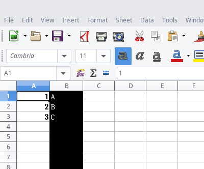

# JSON2EXCL


## Usage
### Help
```
$ ./json2excl.js -h

  Usage: json2excl [options]

  Options:

    -v, --version          output the version number
    -j, --json <file>      JSON file input
    -t, --template <file>  Template file
    -o, --output <file>    Output file
    -V, --verbose
    -h, --help             output usage information
```

### Create Excel File
```
$ ./json2excl.js -j test/files/t1/data.json  -t test/files/t1/template.json -o tmp/test.xlsx -V
parse template
  file: test/files/t1/template.json
  content:
    { columns:
       [ { id: 'A', style: { bold: true } },
         { id: 'B', style: { fill: 'red' } } ] }
parse json
  file: test/files/t1/data.json
  content:
    [ [ 1, 'A' ], [ 2, 'B' ], [ 3, 'C' ] ]
generate workbook
  sheet: 'Sheet1'
  apply template
    column:A
      style:{ bold: true }
    column:B
      style:{ fill: 'red' }
write workbook
  file: tmp/test.xlsx
```




